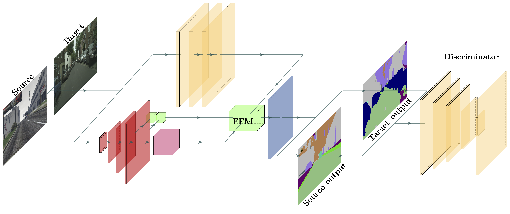

# Adversarial Domain Adaptation Network
Backbone adversarial domain adaptation model for [CoreSegNet](http://github.com/gio99c/CoreSegNet)

## Other repositories
### CoreSegNet
The repository of the context-aware domain adaptation network is available [here](http://www.github.com/gio99c/CoreSegNet)
### Segmentation Network
The repository of the real-time segmentation network is available [here](http://www.github.com/gio99c/BiSeNet)